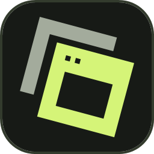
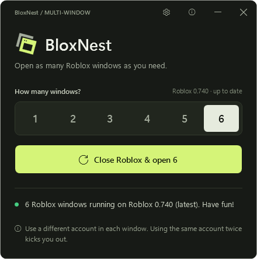

<p align="center">
  
</p>

<h1 align="center">BloxNest</h1>

<p align="center">
  Open more than one Roblox window at once, so you can use a different account in each.<br>
  Free, open source, one small file. Windows 10 and 11.
</p>

<p align="center">
  <a href="https://github.com/yub1dumb/BloxNest/releases/latest/download/BloxNest.exe"><b>Download BloxNest.exe</b></a>
  &nbsp;·&nbsp;
  <a href="https://yub1dumb.github.io/BloxNest/">Website</a>
  &nbsp;·&nbsp;
  <a href="PRIVACY.md">Privacy</a>
</p>

<p align="center">
  
</p>

## What it does

- Pick 1 to 5 windows with one click, or type any number up to 20.
- Keeps Roblox up to date: checks the newest version first and, if yours is behind, runs the Roblox updater that's already on your PC (after checking it's signed by Roblox Corporation).
- Tells you when Roblox updates (checks every 30 minutes while it's running).
- Lives in your hidden icons when you close it. Right-click the icon to open or quit.
- Options: time between windows (3, 5 or 8 seconds), update before opening, update alerts, keep running in hidden icons.

Pressing Start while Roblox is open closes your open Roblox windows first (it asks you to confirm), then opens the number you picked.

Use a different account in each window. The same account twice gets kicked.

## First run

BloxNest isn't code-signed yet, so Windows may show a blue **"Windows protected your PC"** screen. If you downloaded it from this repository's Releases page, click **More info**, then **Run anyway**. Each release lists the file's SHA-256 checksum so you can check your download matches.

## How it works

Roblox normally allows one window. It does that with a named Windows lock (`ROBLOX_singletonEvent`): a new Roblox that finds the lock hands over to the open one. BloxNest claims that name before Roblox starts, so Roblox can't create its lock and skips the check. Roblox also spots an open window by the exact text of its file path, so BloxNest starts each window with the file name spelled in a different upper/lower case (`RobloxPlayerBeta.exe`, `robloxPlayerBeta.exe`, `RObloxPlayerBeta.exe`, ...). Windows treats those as the same file; Roblox treats them as different windows.

It doesn't modify Roblox's files or inject anything into the game. See [`src/Program.cs`](src/Program.cs).

## Can I get banned?

BloxNest doesn't modify Roblox or inject anything, but it isn't made or approved by Roblox, so nobody can promise anything. Use it at your own risk.

## Build it yourself

No SDK needed: the C# compiler that ships with Windows (.NET Framework 4.8) is enough.

```
src\build.bat
```

The app ends up in `bin\BloxNest.exe`. If you change the logo in `src\MainWindow.xaml`, run `src\make-icon.ps1` first to regenerate the icon.

## Why I made this

Hey, I'm xRed1, a student and just a regular dude. I always wanted my alt account open in a second window, playing music for me and my friends while we hang out, so I made BloxNest. I built it on my own with no budget, and it's free.

If it helped you and you want to chip in, even $1 means a lot to me: **juneclark.lm@gmail.com**. Totally optional.

## Licence

MIT. See [LICENSE](LICENSE).

Not affiliated with or endorsed by Roblox Corporation. Roblox is a trademark of Roblox Corporation.
